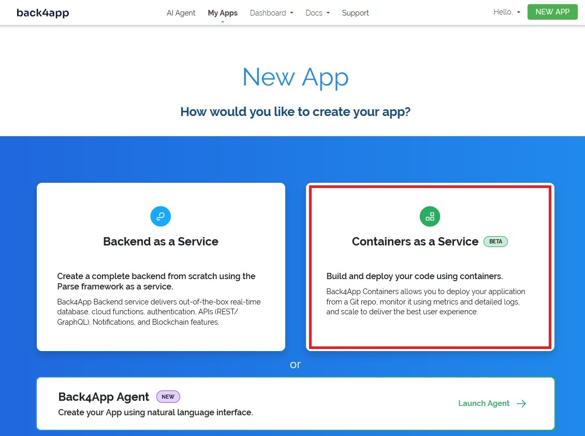

# Vulcan ONE API

Vulcan ONE API is a Go project that provides dynamic handling of API endpoints for Ethereum-related functionalities, such as ERC-20, ERC-721, and ERC-1155 token operations. The API allows users to create webhooks on EVM compatible chain on standardized contracts by specifying the desired contract standard, amount, and address in the API call.

## Getting Started - Deploying without technical skills

- Fork this repository
- Edit configuration.json to add chain and RPC URLs you want to use, sort by priority first in list is being called as main, others are backup.
- Create account using GitHub on Container-as-a-Service provider, for example https://www.back4app.com/.
- Create Container-as-a-Service

- Give permissions and select the forked repository (note that the whale image is Docker logo, not a whale role on back4app)

- Wait until the application builds, on the main dashboard on the left you will have Available and your URL, which you need to use for webhook calls. Or in Settings - Domain, you can add your domain or subdomain for free.


## Example use
Standards for ERC20 compatible call with integer units are keywords "erc20" and "token", for better eading compatibility, if you want to check amount of erc20 use only whole number

standards for ERC721 compatible call with integer units are keywords "erc721" and "nft"

```
yourserverurl/api/evmchainfromconfiguration/erc20/amount/contractaddress
```


standards for ERC1155 compatible call with integer units are keywords "erc1155" and "sft"
I want to verify range of ERC1155 token ids, assuming balance of 1 from any is needed for a role - 


```
yourserverurl/api/evmchainfromconfiguration/erc1155/idstart-idend/contractaddress
```


I want to verify exact amount of ERC1155 token id


```
yourserverurl/api/evmchainfromconfiguration/erc1155/id_balance/contractaddress
```


I want to verify multiple amounts of multiple ERC1155 token id


```
yourserverurl/api/evmchainfromconfiguration/erc1155/id1_balance1&id2_balance2/contractaddress
```


### How to configure Vulcan webhook
- Choose Custom Webhook on your server, you need already prepared role in Discord server, as you can't create role from Vulcan UI


- Add new role and paste the url to custom webhook in Vulcan admin based on examples provided


## Plan
- Increase test coverage
- Native support for - Substrate, ICP, Cosmos
- Improved logs and monitoring - Grafana

# Support
If you use or like this tool, you can support it by:

- contributing as a developer
- donation on Ethereum or any EVM compatible chain: 0x3574060c34A9dA3bE20f4342Af6dB4F21Bc9c95E
- donation on The Root Network: 0xFFFfFfFF0000000000000000000000000000114e
- doanting and requesting your specific chain to be added (contact me on X (@fn00eu) first, to assess the feasibility of the chain being added)